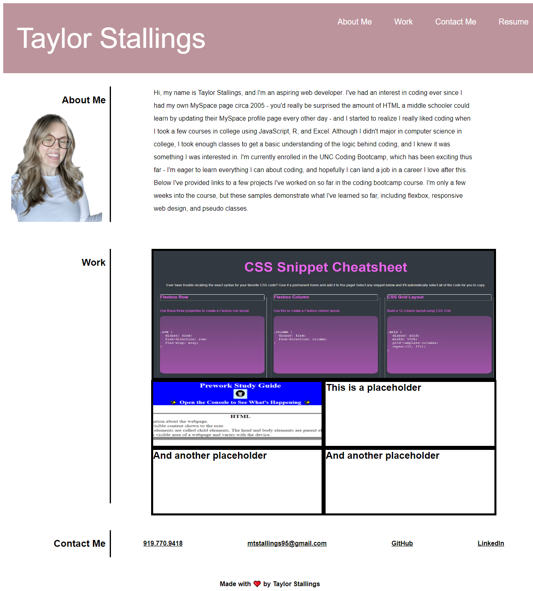

# Taylor Stallings' Coding Portfolio

## Description

The purpose of this website is to showcase deployed applications I have created. This portfolio will be updated throughout my time in the UNC Coding Boot Camp course, and it will ultimately serve as a place that future employers can use to see examples of work I've created.

## Installation
N/A

## Usage

Use this webpage to find out more about my coding background and see examples of work I've created.

Link to deployed website: https://mtstall.github.io/coding-portfolio/

## Credits

N/A
